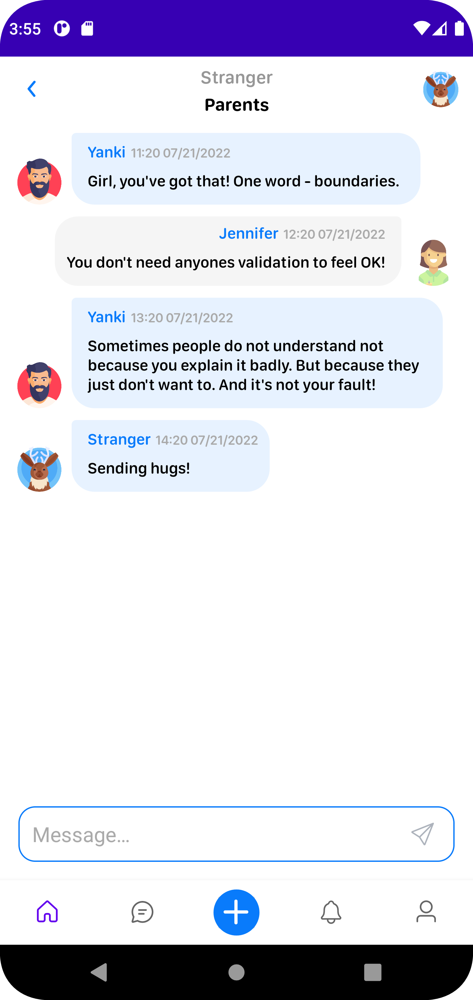
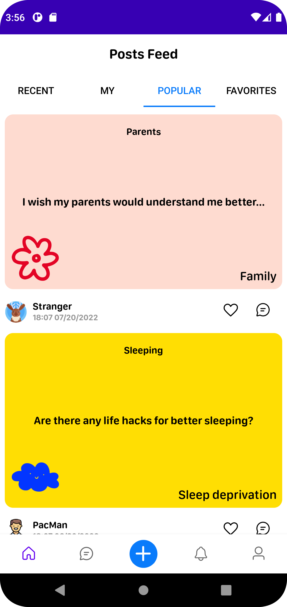
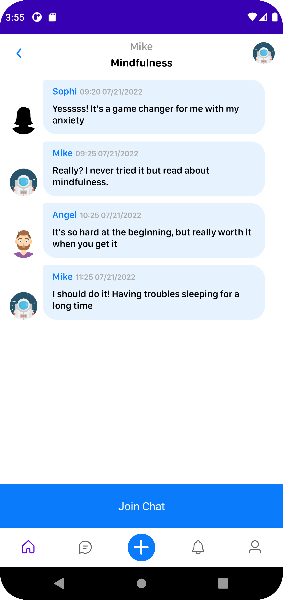
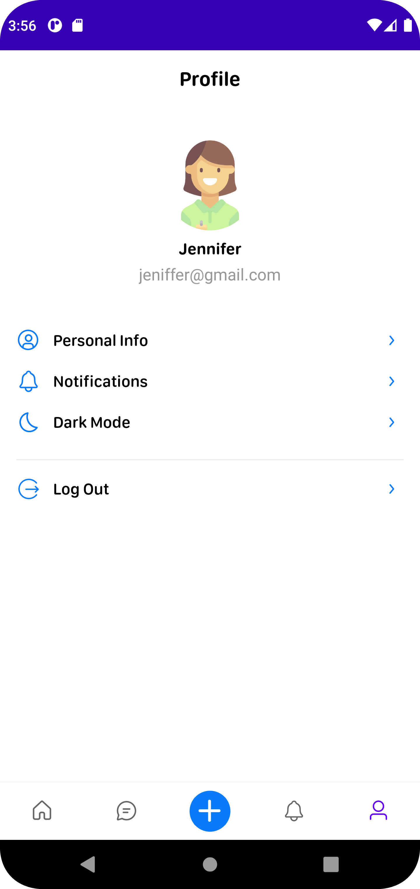
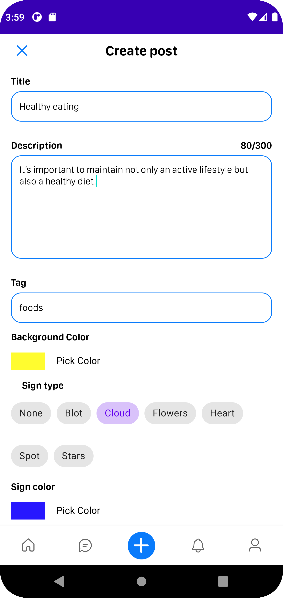

# WellBe android

## Preview
<p align="center">
    
    
    
    
    
</p>

## Introduction

### The WeeBe application is a social media-type app allows users to exchange various content connected with mental health, motivation, psychology, and improving oneself. Users can share posts with texts, images, and links, as well as discuss the content in the comment section

#### Working with HTTP requests and Websockets implemented via the Ktor Client framework. The goal of this project is to show that the Ktor framework allows having one ecosystem and one style throughout the project with Ktor on the backend. One developer with enough experience can easily create both the frontend and backend of the application.
You can check our [wellbe_backend](<https://github.com/perpetio/wellbe_backend>) repo.

## See our tutorial posts:

### Features include:
 - Registration/Login
 - Update user/avatar
 - Create/Edit/Remove post
 - Feed/Popular/Favourite/My posts
 - Like/Unlike post
 - Chats list/Join room
 - Send message

## Used libraries:
* [Ktor Client (Network, Serialization, WebSockets, ContentNegotiation, Logging)](<https://ktor.io/docs/create-client.html>) - Ktor ia a multiplatform asynchronous HTTP client, which allows you to make requests and handle responses, extend its functionality with plugins, such as authentication, JSON serialization, and so on
* [Koin](<https://insert-koin.io/docs/quickstart/android>) - The Kotlin Injection Framework
* Android [Lifecycles](<https://developer.android.com/topic/libraries/architecture/lifecycle>), [Navigation](<https://developer.android.com/guide/navigation/navigation-getting-started>), [DataStore](<https://developer.android.com/topic/libraries/architecture/datastore>)

## Getting started
1. Clone the repo
```
 $ git clone https://github.com/perpetio/wellbe_android
 ```
2. Open project in Android studio or IntelliJ IDEA
3. Run on android device using your IDE's tools.
